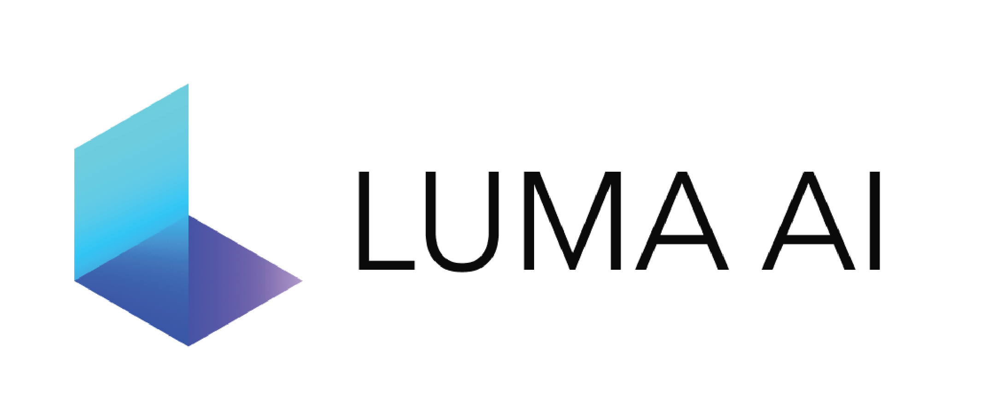
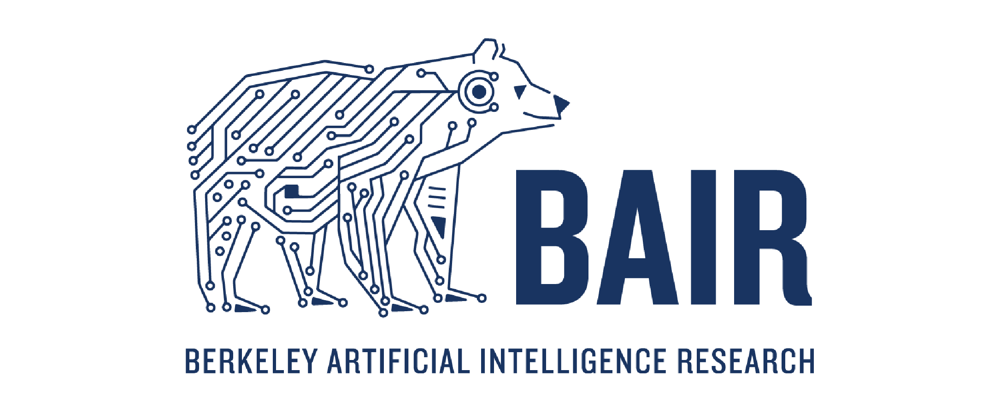

<p align="center">
    <!-- community badges -->
    <a href="https://discord.gg/uMbNqcraFc"></a>
    <!-- doc badges -->
    <a href='https://docs.nerf.studio/'>
        </a>
    <!-- pi package badge -->
    <a href="https://badge.fury.io/py/nerfstudio"></a>
    <!-- code check badges -->
    <a href='https://github.com/nerfstudio-project/nerfstudio/actions/workflows/core_code_checks.yml'>
        </a>
    <!-- license badge -->
    <a href="https://github.com/nerfstudio-project/nerfstudio/blob/master/LICENSE">
        </a>
</p>

<p align="center">
    <!-- pypi-strip -->
    <picture>
    <source media="(prefers-color-scheme: dark)" srcset="https://docs.nerf.studio/_images/logo-dark.png">
    <source media="(prefers-color-scheme: light)" srcset="https://docs.nerf.studio/_images/logo.png">
    <!-- /pypi-strip -->
    
    <!-- pypi-strip -->
    </picture>
    <!-- /pypi-strip -->
</p>

<!-- Use this for pypi package (and disable above). Hacky workaround -->
<!-- <p align="center">
    
</p> -->

<p align="center"> A collaboration friendly studio for NeRFs </p>

<p align="center">
    <a href="https://docs.nerf.studio">
        </a>
    <a href="https://viewer.nerf.studio/">
        </a>
    <a href="https://colab.research.google.com/github/nerfstudio-project/nerfstudio/blob/main/colab/demo.ipynb">
        </a>
</p>

 

- [Quickstart](#quickstart)
- [Learn more](#learn-more)
- [Supported Features](#supported-features)

# Nerfstudio Patch Plan: Frozen Dataset Coordinate Contract

This fork is intended to repair a reproducibility and alignment problem in the standard Nerfstudio data-processing workflow. The planned modification is to move the scene-normalization contract out of training-time dataparser side effects and into the processed dataset itself.

## Problem

In the normal workflow, `ns-process-data` prepares a Nerfstudio-compatible dataset, but the dataparser still computes important model-space quantities later during training. Those quantities include the scene box, dataparser transform, dataparser scale, camera normalization, and train/eval interpretation.

That behavior is acceptable for a single model, but it becomes fragile when comparing or combining multiple radiance fields. If Nerfacto and an InvNeRF-style semantic model recompute normalization independently, then both models can be trained from the same images while silently living in different normalized coordinate systems. This creates downstream alignment problems for candidate-region construction, density querying, voxel comparison, and object-support evaluation.

The target design is therefore:

```text
Dataset owns the coordinate contract.
Training consumes the coordinate contract.
Outputs store model results only.
```

## Desired Dataset Layout

The processed dataset should become self-contained:

```text
Dataset/
  images/
  transforms.json

  metadata/
    dataset_manifest.json
    processing_config.json
    sfm_summary.json

    dataparser/
      dataparser_outputs.json
      scene_box.json
      normalization.json
      camera_model.json
      raw_to_model_transform.json
      model_to_raw_transform.json

    splits/
      train_filenames.txt
      eval_filenames.txt
      train_indices.json
      eval_indices.json
```

The important distinction is that `transforms.json` remains the raw camera/input description, while `metadata/dataparser/` stores the frozen Nerfstudio interpretation of that dataset.

## Planned `ns-process-data` Responsibility

The patched `ns-process-data` pipeline should perform the full deterministic dataset preparation chain:

```text
raw images
-> structure from motion / pose estimation
-> transforms.json
-> fixed train/eval split
-> frozen dataparser metadata
-> fixed normalized camera/model space
-> training-ready dataset
```

The data-processing stage should own these outputs:

- Structure-from-motion output or imported calibration.
- `transforms.json` with image paths, intrinsics, distortion, and camera-to-world matrices.
- Scene box used by Nerfstudio.
- Dataparser transform matrix.
- Dataparser scale.
- Raw/world to normalized model-space transform.
- Normalized model-space to raw/world inverse transform.
- Explicit train/eval split files.
- Processing and schema metadata sufficient to reload the contract deterministically.

## Training-Side Rule

Training should read the frozen dataset contract instead of redefining it:

```text
ns-train nerfacto --data Dataset/
  -> reads transforms.json
  -> reads metadata/dataparser/*
  -> uses fixed normalization and fixed split
```

and similarly:

```text
ns-train invnerf --data Dataset/
  -> reads the same metadata/dataparser/*
  -> uses the same normalized camera/model space
```

This makes Nerfacto and InvNeRF consume the same camera split, scene bounds, scale, and world-to-model transform.

## Why This Matters for InvNeRF-Seg Work

The downstream InvNeRF-Seg-style pipeline depends on using one coordinate space consistently:

```text
semantic support from InvNeRF
and
Nerfacto density/color queries
```

must refer to the same normalized model coordinates. If this contract is frozen at dataset-processing time, the semantic support exported from the mask-refined field and the base Nerfacto density/color field can be compared or combined without relying on post-hoc coordinate repair.

This directly supports:

- Candidate-region construction.
- AABB generation from semantic support.
- Local voxel-grid querying.
- Nerfacto density/color sampling inside semantic regions.
- Reproducible comparison across dataset variants.
- Cleaner debugging when a model fails because normalization is no longer a hidden variable.

## Serialization Schema Requirements

The serialized dataparser contract should be versioned. A minimal metadata payload should include:

```json
{
  "schema_version": 1,
  "nerfstudio_version": "...",
  "dataparser_class": "...",
  "normalization_method": "...",
  "dataparser_transform": [[...], [...], [...], [...]],
  "dataparser_scale": 1.0,
  "scene_box": {
    "aabb": [[...], [...]]
  },
  "raw_to_model_transform": [[...], [...], [...], [...]],
  "model_to_raw_transform": [[...], [...], [...], [...]],
  "train_filenames": [...],
  "eval_filenames": [...]
}
```

The schema should be treated as a coordinate contract. Any code path that changes normalization should either update the schema version or refuse to reuse incompatible metadata.

## Proposed Implementation Strategy

The first implementation should be optional and conservative:

```text
ns-process-data images \
  --save-dataparser-contract \
  --fixed-train-eval-split
```

Training should then support an explicit loading mode:

```text
ns-train nerfacto \
  --data Dataset/ \
  --load-dataparser-contract
```

Initial behavior should not remove the default Nerfstudio path. The patch should add a deterministic mode first, validate it, and only later decide whether it becomes the preferred default for this fork.

### Process-Data Serializer Design

The first implementation should call the existing dataparser after the normal `ns-process-data` conversion has completed. In other words, the patch should not duplicate the scene-normalization math inside the process-data converter. It should reuse the same dataparser code path that training would otherwise use.

The intended call chain is:

```text
nerfstudio/scripts/process_data.py
  -> calls the selected process-data converter

nerfstudio/process_data/*
  -> creates images/, transforms.json, masks, COLMAP/GLOMAP outputs, etc.

optional frozen-contract stage
  -> instantiates the selected dataparser
  -> reads the completed dataset
  -> obtains train/eval DataparserOutputs
  -> serializes the coordinate contract into metadata/dataparser/
```

This stage should run only after `transforms.json` and the processed dataset assets exist. It should not call training code.

The preferred utility location is:

```text
nerfstudio/process_data/dataparser_contract.py
```

This keeps the serializer close to dataset creation while avoiding file-writing side effects inside the dataparser itself. The dataparser remains responsible for computing the scene interpretation; the process-data serializer is responsible for persisting that interpretation.

A minimal serializer API could be:

```python
def serialize_dataparser_contract(
    data: Path,
    output_dir: Path | None = None,
    dataparser_config: DataParserConfig | None = None,
    split_policy: str = "existing",
) -> Path:
    ...
```

The minimal implementation can instantiate the intended Nerfstudio dataparser, obtain outputs for `train` and `eval`, and write:

```text
metadata/dataparser/contract.json
metadata/dataparser/scene_box.json
metadata/dataparser/cameras_train.json
metadata/dataparser/cameras_eval.json
metadata/dataparser/splits.json
```

Using private dataparser methods such as `_generate_dataparser_outputs(split="train")` is acceptable for the first patch if needed, but the cleaner long-term API is a public method such as:

```python
get_dataparser_outputs(split: Literal["train", "eval"])
```

The dependency direction should remain one-way:

```text
process_data may import dataparsers
dataparsers should not import process_data
```

That avoids circular dependencies and preserves the conceptual split: process-data builds and freezes the dataset contract; training loads and consumes it.

### Tyro CLI Integration Options

There are two viable ways to expose this through `tyro`.

The first option is to expose the full dataparser config API directly in `ns-process-data`. Nerfstudio already aggregates dataparser configs in:

```text
nerfstudio/configs/dataparser_configs.py
```

The relevant type is:

```python
from nerfstudio.configs.dataparser_configs import AnnotatedDataParserUnion
```

A base converter could then expose a dataparser field:

```python
from dataclasses import field
from nerfstudio.configs.dataparser_configs import AnnotatedDataParserUnion
from nerfstudio.data.dataparsers.nerfstudio_dataparser import NerfstudioDataParserConfig

@dataclass
class BaseConverterToNerfstudioDataset(ABC):
    ...
    dataparser: AnnotatedDataParserUnion = field(default_factory=NerfstudioDataParserConfig)
```

Because all process-data commands inherit from `BaseConverterToNerfstudioDataset`, `tyro` would expose the dataparser config for images, video, Polycam, Record3D, ODM, and the other converters. Before serialization, the converter must force the dataparser input path to the processed dataset, not the raw input path:

```python
self.dataparser.data = self.output_dir
serialize_dataparser_contract(
    dataset_dir=self.output_dir,
    dataparser_config=self.dataparser,
)
```

This gives maximum flexibility, but it may make the command line more complex because `tyro` will expose a nested dataparser subcommand/union inside every `ns-process-data` command.

The second option is the recommended first implementation: expose a small contract-specific config through `tyro`, then internally construct `NerfstudioDataParserConfig`. For example:

```python
@dataclass
class DataparserContractConfig:
    eval_mode: Literal["fraction", "filename", "interval", "all"] = "fraction"
    train_split_fraction: float = 0.9
    eval_interval: int = 8
    orientation_method: Literal["pca", "up", "vertical", "none"] = "none"
    center_method: Literal["poses", "focus", "none"] = "poses"
    auto_scale_poses: bool = True
    scene_scale: float = 1.0
    scale_factor: float = 1.0
```

Then the base converter can own a single field:

```python
@dataclass
class BaseConverterToNerfstudioDataset(ABC):
    ...
    dataparser_contract: DataparserContractConfig = field(default_factory=DataparserContractConfig)
```

The serializer can build the dataparser config internally:

```python
config = NerfstudioDataParserConfig(
    data=self.output_dir,
    eval_mode=self.dataparser_contract.eval_mode,
    train_split_fraction=self.dataparser_contract.train_split_fraction,
    eval_interval=self.dataparser_contract.eval_interval,
    orientation_method=self.dataparser_contract.orientation_method,
    center_method=self.dataparser_contract.center_method,
    auto_scale_poses=self.dataparser_contract.auto_scale_poses,
    scene_scale=self.dataparser_contract.scene_scale,
    scale_factor=self.dataparser_contract.scale_factor,
)
```

This keeps `ns-process-data` cleaner while still making the frozen contract available to all converters. There is no enable/disable boolean: serialized dataparser metadata is part of the processed dataset contract. The full `AnnotatedDataParserUnion` approach can be added later if non-Nerfstudio-format dataparsers need to be selected from the process-data command line.

The preferred implementation order is therefore:

1. Add `DataparserContractConfig` and universal base-converter plumbing.
2. Serialize a Nerfstudio-format contract after `transforms.json` exists.
3. Validate invariant scene box, transform, scale, and split across Nerfacto and InvNeRF-style training.
4. Only then consider exposing the full `AnnotatedDataParserUnion` in `ns-process-data`.

### Integrated `ns-process-data` Behavior

The first working implementation integrates contract serialization into the existing `ns-process-data` converters instead of requiring a separate public command. After each converter writes `transforms.json`, it calls the shared serializer from:

```text
nerfstudio/process_data/dataparser_contract.py
```

The integration point is the base converter helper:

```python
def _save_dataparser_contract(self) -> str:
    contract_path = serialize_dataparser_contract(
        self.output_dir,
        contract=self.dataparser_contract,
    )
    return f"Saved dataparser contract to {contract_path}"
```

The helper is called by the process-data converters after dataset creation, for example in `ImagesToNerfstudioDataset` after `_save_transforms(...)`. The same pattern is applied to video and the other process-data sources that write Nerfstudio-format `transforms.json` files.

The generated files are:

```text
/path/to/processed_dataset/metadata/dataparser/contract.json
/path/to/processed_dataset/metadata/dataparser/scene_box.json
/path/to/processed_dataset/metadata/dataparser/splits.json
```

The contract options are exposed directly through `ns-process-data` by the inherited `dataparser_contract` field. Example:

```bash
ns-process-data images \
  --data /path/to/raw_images \
  --output-dir /path/to/processed_dataset \
  --dataparser-contract.eval-mode interval \
  --dataparser-contract.eval-interval 8 \
  --dataparser-contract.orientation-method none \
  --dataparser-contract.center-method poses \
  --dataparser-contract.auto-scale-poses
```

There is no enable/disable boolean. In this fork, serialized dataparser metadata is part of the processed dataset contract and is produced whenever `ns-process-data` successfully creates the dataset.

### Training-Time Contract Loading

`ns-train` now consumes the frozen contract automatically for Nerfstudio-format datasets. When the selected dataset contains:

```text
metadata/dataparser/contract.json
```

the `Nerfstudio` dataparser loads the serialized train/test `DataparserOutputs` from that file instead of recomputing camera normalization, scene scale, scene box, or train/eval splits from `transforms.json`. If the contract is absent, the normal Nerfstudio dataparser path remains available as a fallback for legacy datasets.

This makes the processed dataset the authority for the normalized model space:

```text
ns-process-data
  -> writes transforms.json
  -> freezes metadata/dataparser/contract.json

ns-train
  -> reads metadata/dataparser/contract.json
  -> uses the same cameras, scene box, transform, scale, and splits
```

### Multi-Image Modality Contract

The dataparser contract also preserves aligned image modalities without interpreting their pixel values. The canonical RGB path remains `file_path`. Any additional frame key ending in `_img` is treated as an optional auxiliary modality and stored as paths under `DataparserOutputs.metadata["image_modalities"]`. Examples include:

```text
binary_img
semantic_img
depth_img
instance_img
```

The serialized contract keeps those modality paths split-aligned with the RGB images:

```json
{
  "splits": {
    "train": {
      "metadata": {
        "image_modalities": {
          "binary_img": ["binary_imgs/frame_00001.png"]
        }
      }
    }
  }
}
```

This layer does not normalize, threshold, rescale, or rewrite auxiliary image files. Standard Nerfacto can ignore these metadata fields. InvNeRF-style datasets can read `dataparser_outputs.metadata["image_modalities"]["binary_img"]` and decide how to load and normalize masks for their own batches.

When a modality is missing for a frame, the metadata list preserves a `null` entry instead of dropping or reindexing frames. This keeps RGB cameras, splits, and auxiliary paths aligned while making incomplete modality coverage explicit.

### Current Validated Cherrytree Workflow

The current end-to-end validation dataset is:

```text
/workspace/Desktop/DATASETS/IMAGES/cherrytree
```

It contains both full-resolution and 2x downscaled aligned modalities:

```text
images/          337 RGB images
binary_imgs/     337 binary masks
images_2/        337 RGB images at 2x downscale
binary_imgs_2/   337 binary masks at 2x downscale
```

The active frozen contract is configured with `downscale_factor=2`, so training loads:

```text
images_2/
binary_imgs_2/
```

The current contract resolves to:

```text
train: 294 RGB frames + 294 binary_img entries, 0 nulls
test:   43 RGB frames +  43 binary_img entries, 0 nulls
```

One missing binary mask was repaired manually with the fruit segmentation model:

```text
/workspace/Desktop/DATASETS/IMAGES/cherrytree/images/frame_00314.JPG
-> /workspace/Desktop/DATASETS/IMAGES/cherrytree/binary_imgs/frame_00314.png
```

After generating that mask, the contract was refreshed and no `null` auxiliary image entries remain.

### Smoke-Test Commands

Check the active contract:

```bash
cd /workspace/Desktop/Repos/Nerfstudio_Patch

python - <<'PY'
import json
from pathlib import Path

root = Path("/workspace/Desktop/DATASETS/IMAGES/cherrytree")
c = json.loads((root / "metadata/dataparser/contract.json").read_text())
print("downscale:", c["contract_config"]["downscale_factor"])
for split in ("train", "test"):
    imgs = c["splits"][split]["image_filenames"]
    bins = c["splits"][split]["metadata"]["image_modalities"]["binary_img"]
    print(split, len(imgs), len(bins), "nulls:", sum(x is None for x in bins))
    print("  first rgb:", imgs[0])
    print("  first binary:", bins[0])
PY
```

Nerfacto smoke test:

```bash
cd /workspace/Desktop/Repos/Nerfstudio_Patch
rm -rf /tmp/ns_cherrytree_nerfacto_ds2_smoke

PYTHONPATH=. ns-train nerfacto \
  --data /workspace/Desktop/DATASETS/IMAGES/cherrytree \
  --output-dir /tmp/ns_cherrytree_nerfacto_ds2_smoke \
  --experiment-name cherrytree_nerfacto_ds2_smoke \
  --timestamp smoke \
  --vis tensorboard \
  --max-num-iterations 1 \
  --steps-per-save 1000000 \
  --steps-per-eval-batch 1000000 \
  --steps-per-eval-image 1000000 \
  --steps-per-eval-all-images 1000000 \
  --mixed-precision False \
  --machine.device-type cpu \
  --pipeline.model.implementation torch \
  --pipeline.datamanager.load-from-disk True \
  nerfstudio-data
```

InvNeRF smoke test must explicitly match the frozen split/downscale until the InvNeRF dataparser is patched to consume the frozen contract directly:

```bash
cd /workspace/Desktop/Repos/Nerfstudio_Patch
rm -rf /tmp/ns_cherrytree_invnerf_ds2_smoke

PYTHONPATH=. ns-train inv-nerf \
  --data /workspace/Desktop/DATASETS/IMAGES/cherrytree \
  --output-dir /tmp/ns_cherrytree_invnerf_ds2_smoke \
  --experiment-name cherrytree_invnerf_ds2_smoke \
  --timestamp smoke \
  --vis tensorboard \
  --max-num-iterations 1 \
  --steps-per-save 1000000 \
  --steps-per-eval-batch 1000000 \
  --steps-per-eval-image 1000000 \
  --steps-per-eval-all-images 1000000 \
  --mixed-precision False \
  --machine.device-type cpu \
  --pipeline.datamanager.dataparser.eval-mode interval \
  --pipeline.datamanager.dataparser.eval-interval 8 \
  --pipeline.datamanager.dataparser.orientation-method none \
  --pipeline.datamanager.dataparser.center-method poses \
  --pipeline.datamanager.dataparser.downscale-factor 2
```

Expected InvNeRF split when configured correctly:

```text
Caching all 294 images.
Setting up evaluation dataset...
Caching all 43 images.
```

### Training and Export Notes

Nerfacto pointcloud export must use Open3D normals unless the model was trained with predicted normals:

```bash
ns-export pointcloud \
  --load-config /workspace/Desktop/Repos/CHERRYTREE_TRAINING_TEST/nerfacto/cherrytree_nerfacto_ds2/nerfacto/run_000/config.yml \
  --output-dir /workspace/Desktop/Repos/CHERRYTREE_TRAINING_TEST/exports/nerfacto_pointcloud \
  --num-points 1000000 \
  --remove-outliers True \
  --normal-method open3d
```

Do not use a full Nerfacto checkpoint as a direct InvNeRF checkpoint with `--load-checkpoint` unless the model architectures and train-camera counts match exactly. The observed mismatch was:

```text
Nerfacto checkpoint: 294 appearance embeddings, 128 dims
InvNeRF model:       304 appearance embeddings, 32 dims
```

The correct next implementation is either:

1. patch InvNeRF to consume the frozen contract directly; and
2. implement partial-compatible Nerfacto-to-InvNeRF initialization instead of loading the full checkpoint state dict.

Generic `ns-export pointcloud` is not compatible with the custom InvNeRF datamanager. InvNeRF semantic exports should use InvNeRF-specific sampling/export code.

### Only Sampling the InvNeRF Semantic Cloud

For the semantic cloud only, avoid the full `ns-export-inv-nerf` wrapper because it continues into filtering, clusters, bboxes, and optional Nerfacto resampling. The minimal sampling path is:

```text
config_initialization_THREAD(...)
-> pipeline.datamanager.next_train(...)
-> pipeline.model(ray_bundle)
-> choose a 3D point per ray from model outputs
-> write semantic point cloud
```

The original helper used rendered `depth`:

```python
point = ray_bundle.origins + ray_bundle.directions * depth
```

On the current cherrytree InvNeRF run this collapsed the PLY close to camera origins. Validation showed nearest camera-origin distances around `2e-4`, so the saved PLY contained computed points, but those points were practically camera origins because the rendered depth signal was near zero.

The repaired direct sampler uses density peaks and `t_mid` instead:

```python
sigma = outputs["density"].reshape(num_rays, -1)
t_mid = outputs["t_mid"].reshape(num_rays, -1)
peak_idx = sigma.argmax(dim=1)
t_peak = t_mid[torch.arange(sigma.shape[0]), peak_idx]
points = ray_bundle.origins + ray_bundle.directions * t_peak[:, None]
```

Minimal direct script:

```bash
cd /workspace/Desktop/Repos/Nerfstudio_Patch

PYTHONPATH=/workspace/Desktop/Repos/Nerfstudio_Patch:/workspace/Desktop/Repos/InvNeRF-Seg python - <<'PY'
from pathlib import Path

import open3d as o3d
import torch
from rich.progress import BarColumn, Progress, TaskProgressColumn, TextColumn, TimeRemainingColumn

from InvNeRF.config.config_utils import config_initialization_THREAD
from nerfstudio.cameras.rays import RayBundle
from nerfstudio.utils.rich_utils import CONSOLE

CONFIG = Path("/workspace/Desktop/Repos/CHERRYTREE_TRAINING_TEST/invnerf/cherrytree_invnerf_ds2_no_preload/inv-nerf/run_000/config.yml")
OUT_DIR = Path("/workspace/Desktop/Repos/CHERRYTREE_TRAINING_TEST/exports/invnerf_semantic_sample_only_repaired")
OUT_DIR.mkdir(parents=True, exist_ok=True)

NUM_RAYS_PER_BATCH = 4096
NUM_POINTS = 1_000_000
ACC_THRESHOLD = 0.1
DENSITY_THRESHOLD = 0.0
MAX_BATCHES = 5000

_, pipeline, checkpoint_path, step = config_initialization_THREAD(CONFIG, num_rays_per_batch=NUM_RAYS_PER_BATCH)

points_all = []
density_all = []
accumulation_all = []
t_all = []

def flatten_samples(x: torch.Tensor) -> torch.Tensor:
    x = torch.nan_to_num(x)
    if x.dim() == 1:
        return x[:, None]
    if x.dim() == 2:
        return x
    return x.reshape(x.shape[0], -1)

with Progress(
    TextColumn(":cloud: Sampling semantic cloud from density peaks"),
    BarColumn(),
    TaskProgressColumn(show_speed=True),
    TimeRemainingColumn(elapsed_when_finished=True, compact=True),
    console=CONSOLE,
) as progress:
    task = progress.add_task("semantic samples", total=NUM_POINTS)
    for _ in range(MAX_BATCHES):
        if sum(x.shape[0] for x in points_all) >= NUM_POINTS:
            break
        with torch.no_grad():
            ray_bundle, _ = pipeline.datamanager.next_train(0)
            assert isinstance(ray_bundle, RayBundle)
            outputs = pipeline.model(ray_bundle)

        sigma = flatten_samples(outputs["density"])
        t_mid = flatten_samples(outputs["t_mid"])
        n = min(sigma.shape[0], t_mid.shape[0])
        s = min(sigma.shape[1], t_mid.shape[1])
        sigma = sigma[:n, :s]
        t_mid = t_mid[:n, :s]

        peak_idx = sigma.argmax(dim=1)
        ray_ids = torch.arange(sigma.shape[0], device=sigma.device)
        sigma_peak = sigma[ray_ids, peak_idx]
        t_peak = t_mid[ray_ids, peak_idx]

        if "accumulation" in outputs:
            acc = flatten_samples(outputs["accumulation"]).max(dim=1).values[: sigma_peak.shape[0]]
        else:
            acc = torch.ones_like(sigma_peak)

        valid = (acc > ACC_THRESHOLD) & (sigma_peak > DENSITY_THRESHOLD) & torch.isfinite(t_peak)
        origins = ray_bundle.origins[: sigma_peak.shape[0]]
        directions = ray_bundle.directions[: sigma_peak.shape[0]]
        points = origins + directions * t_peak[:, None]

        points = points[valid]
        sigma_peak = sigma_peak[valid]
        acc = acc[valid]
        t_peak = t_peak[valid]
        if points.numel() == 0:
            continue

        points_cpu = points.detach().cpu()
        points_all.append(points_cpu)
        density_all.append(sigma_peak.detach().cpu())
        accumulation_all.append(acc.detach().cpu())
        t_all.append(t_peak.detach().cpu())
        progress.advance(task, points_cpu.shape[0])

points = torch.cat(points_all, dim=0)[:NUM_POINTS] if points_all else torch.empty((0, 3))
density = torch.cat(density_all, dim=0)[:NUM_POINTS] if density_all else torch.empty((0,))
accumulation = torch.cat(accumulation_all, dim=0)[:NUM_POINTS] if accumulation_all else torch.empty((0,))
t_peak = torch.cat(t_all, dim=0)[:NUM_POINTS] if t_all else torch.empty((0,))

pcd = o3d.geometry.PointCloud()
pcd.points = o3d.utility.Vector3dVector(points.double().numpy())

ply_path = OUT_DIR / "semantic_cloud_density_peak.ply"
pt_path = OUT_DIR / "semantic_cloud_density_peak.pt"
o3d.io.write_point_cloud(str(ply_path), pcd)
torch.save(
    {
        "config_path": str(CONFIG),
        "checkpoint_path": str(checkpoint_path),
        "step": int(step),
        "sampling_method": "origin_plus_direction_times_t_mid_at_peak_density",
        "acc_threshold": ACC_THRESHOLD,
        "density_threshold": DENSITY_THRESHOLD,
        "points": points,
        "density": density,
        "accumulation": accumulation,
        "t_peak": t_peak,
    },
    pt_path,
)
print("Wrote:", ply_path)
print("Wrote:", pt_path)
print("points:", points.shape[0])
PY
```

Outputs:

```text
/workspace/Desktop/Repos/CHERRYTREE_TRAINING_TEST/exports/invnerf_semantic_sample_only_repaired/semantic_cloud_density_peak.ply
/workspace/Desktop/Repos/CHERRYTREE_TRAINING_TEST/exports/invnerf_semantic_sample_only_repaired/semantic_cloud_density_peak.pt
```

## Validation Plan

The validation should check that the serialized contract is actually invariant:

1. Run `ns-process-data` once and save the dataparser contract.
2. Train Nerfacto using the frozen contract.
3. Train InvNeRF-style semantic refinement using the same frozen contract.
4. Verify both models report the same scene box, dataparser transform, scale, and train/eval split.
5. Export semantic support and query Nerfacto density/color in the same coordinates.
6. Confirm that no post-hoc camera-pose or ICP repair is needed for same-dataset InvNeRF-to-Nerfacto alignment.

## Artifact Boundary

Training artifacts must not be committed to this repository. The repository ignores generated training data and model weights:

```text
outputs/
wandb/
*.ckpt
*.pt
*.pth
*.safetensors
nerfstudio_models/
```

The patch should contain source code, documentation, and lightweight metadata examples only. Checkpoints and run outputs belong outside git or in a dedicated artifact store.

# About

_It’s as simple as plug and play with nerfstudio!_

Nerfstudio provides a simple API that allows for a simplified end-to-end process of creating, training, and testing NeRFs.
The library supports a **more interpretable implementation of NeRFs by modularizing each component.**
With more modular NeRFs, we hope to create a more user-friendly experience in exploring the technology.

This is a contributor-friendly repo with the goal of building a community where users can more easily build upon each other's contributions.
Nerfstudio initially launched as an opensource project by Berkeley students in [KAIR lab](https://people.eecs.berkeley.edu/~kanazawa/index.html#kair) at [Berkeley AI Research (BAIR)](https://bair.berkeley.edu/) in October 2022 as a part of a research project ([paper](https://arxiv.org/abs/2302.04264)). It is currently developed by Berkeley students and community contributors.

We are committed to providing learning resources to help you understand the basics of (if you're just getting started), and keep up-to-date with (if you're a seasoned veteran) all things NeRF. As researchers, we know just how hard it is to get onboarded with this next-gen technology. So we're here to help with tutorials, documentation, and more!

Have feature requests? Want to add your brand-spankin'-new NeRF model? Have a new dataset? **We welcome [contributions](https://docs.nerf.studio/reference/contributing.html)!** Please do not hesitate to reach out to the nerfstudio team with any questions via [Discord](https://discord.gg/uMbNqcraFc).

Have feedback? We'd love for you to fill out our [Nerfstudio Feedback Form](https://forms.gle/sqN5phJN7LfQVwnP9) if you want to let us know who you are, why you are interested in Nerfstudio, or provide any feedback!

We hope nerfstudio enables you to build faster :hammer: learn together :books: and contribute to our NeRF community :sparkling_heart:.

## Sponsors

Sponsors of this work includes [Luma AI](https://lumalabs.ai/) and the [BAIR commons](https://bcommons.berkeley.edu/home).

<p align="left">
    <a href="https://lumalabs.ai/">
        <!-- pypi-strip -->
        <picture>
        <source media="(prefers-color-scheme: dark)" srcset="docs/_static/imgs/luma_dark.png">
        <source media="(prefers-color-scheme: light)" srcset="docs/_static/imgs/luma_light.png">
        <!-- /pypi-strip -->
        
        <!-- pypi-strip -->
        </picture>
        <!-- /pypi-strip -->
    </a>
    <a href="https://bcommons.berkeley.edu/home">
        <!-- pypi-strip -->
        <picture>
        <source media="(prefers-color-scheme: dark)" srcset="docs/_static/imgs/bair_dark.png">
        <source media="(prefers-color-scheme: light)" srcset="docs/_static/imgs/bair_light.png">
        <!-- /pypi-strip -->
        
        <!-- pypi-strip -->
        </picture>
        <!-- /pypi-strip -->
    </a>
</p>

# Quickstart

The quickstart will help you get started with the default vanilla NeRF trained on the classic Blender Lego scene.
For more complex changes (e.g., running with your own data/setting up a new NeRF graph), please refer to our [references](#learn-more).

## 1. Installation: Setup the environment

### Prerequisites

You must have an NVIDIA video card with CUDA installed on the system. This library has been tested with version 11.8 of CUDA. You can find more information about installing CUDA [here](https://docs.nvidia.com/cuda/cuda-quick-start-guide/index.html)

### Create environment

Nerfstudio requires `python >= 3.8`. We recommend using conda to manage dependencies. Make sure to install [Conda](https://docs.conda.io/miniconda.html) before proceeding.

```bash
conda create --name nerfstudio -y python=3.8
conda activate nerfstudio
pip install --upgrade pip
```

### Dependencies

Install PyTorch with CUDA (this repo has been tested with CUDA 11.7 and CUDA 11.8) and [tiny-cuda-nn](https://github.com/NVlabs/tiny-cuda-nn).
`cuda-toolkit` is required for building `tiny-cuda-nn`.

For CUDA 11.8:

```bash
pip install torch==2.1.2+cu118 torchvision==0.16.2+cu118 --extra-index-url https://download.pytorch.org/whl/cu118

conda install -c "nvidia/label/cuda-11.8.0" cuda-toolkit
pip install ninja git+https://github.com/NVlabs/tiny-cuda-nn/#subdirectory=bindings/torch
```

See [Dependencies](https://github.com/nerfstudio-project/nerfstudio/blob/main/docs/quickstart/installation.md#dependencies)
in the Installation documentation for more.

### Installing nerfstudio

Easy option:

```bash
pip install nerfstudio
```

**OR** if you want the latest and greatest:

```bash
git clone https://github.com/nerfstudio-project/nerfstudio.git
cd nerfstudio
pip install --upgrade pip setuptools
pip install -e .
```

**OR** if you want to skip all installation steps and directly start using nerfstudio, use the docker image:

See [Installation](https://github.com/nerfstudio-project/nerfstudio/blob/main/docs/quickstart/installation.md) - **Use docker image**.

## 2. Training your first model!

The following will train a _nerfacto_ model, our recommended model for real world scenes.

```bash
# Download some test data:
ns-download-data nerfstudio --capture-name=poster
# Train model
ns-train nerfacto --data data/nerfstudio/poster
```

If everything works, you should see training progress like the following:

<p align="center">
    
</p>

Navigating to the link at the end of the terminal will load the webviewer. If you are running on a remote machine, you will need to port forward the websocket port (defaults to 7007).

<p align="center">
    
</p>

### Resume from checkpoint / visualize existing run

It is possible to load a pretrained model by running

```bash
ns-train nerfacto --data data/nerfstudio/poster --load-dir {outputs/.../nerfstudio_models}
```

## Visualize existing run

Given a pretrained model checkpoint, you can start the viewer by running

```bash
ns-viewer --load-config {outputs/.../config.yml}
```

## 3. Exporting Results

Once you have a NeRF model you can either render out a video or export a point cloud.

### Render Video

First we must create a path for the camera to follow. This can be done in the viewer under the "RENDER" tab. Orient your 3D view to the location where you wish the video to start, then press "ADD CAMERA". This will set the first camera key frame. Continue to new viewpoints adding additional cameras to create the camera path. We provide other parameters to further refine your camera path. Once satisfied, press "RENDER" which will display a modal that contains the command needed to render the video. Kill the training job (or create a new terminal if you have lots of compute) and run the command to generate the video.

Other video export options are available, learn more by running

```bash
ns-render --help
```

### Generate Point Cloud

While NeRF models are not designed to generate point clouds, it is still possible. Navigate to the "EXPORT" tab in the 3D viewer and select "POINT CLOUD". If the crop option is selected, everything in the yellow square will be exported into a point cloud. Modify the settings as desired then run the command at the bottom of the panel in your command line.

Alternatively you can use the CLI without the viewer. Learn about the export options by running

```bash
ns-export pointcloud --help
```

## 4. Using Custom Data

Using an existing dataset is great, but likely you want to use your own data! We support various methods for using your own data. Before it can be used in nerfstudio, the camera location and orientations must be determined and then converted into our format using `ns-process-data`. We rely on external tools for this, instructions and information can be found in the documentation.

| Data                                                                                          | Capture Device | Requirements                                                      | `ns-process-data` Speed |
| --------------------------------------------------------------------------------------------- | -------------- | ----------------------------------------------------------------- | ----------------------- |
| 📷 [Images](https://docs.nerf.studio/quickstart/custom_dataset.html#images-or-video)          | Any            | [COLMAP](https://colmap.github.io/install.html)                   | 🐢                      |
| 📹 [Video](https://docs.nerf.studio/quickstart/custom_dataset.html#images-or-video)           | Any            | [COLMAP](https://colmap.github.io/install.html)                   | 🐢                      |
| 🌎 [360 Data](https://docs.nerf.studio/quickstart/custom_dataset.html#data-equirectangular)   | Any            | [COLMAP](https://colmap.github.io/install.html)                   | 🐢                      |
| 📱 [Polycam](https://docs.nerf.studio/quickstart/custom_dataset.html#polycam-capture)         | IOS with LiDAR | [Polycam App](https://poly.cam/)                                  | 🐇                      |
| 📱 [KIRI Engine](https://docs.nerf.studio/quickstart/custom_dataset.html#kiri-engine-capture) | IOS or Android | [KIRI Engine App](https://www.kiriengine.com/)                    | 🐇                      |
| 📱 [Record3D](https://docs.nerf.studio/quickstart/custom_dataset.html#record3d-capture)       | IOS with LiDAR | [Record3D app](https://record3d.app/)                             | 🐇                      |
| 📱 [Spectacular AI](https://docs.nerf.studio/quickstart/custom_dataset.html#spectacularai)    | IOS, OAK, [others](https://www.spectacularai.com/mapping#supported-devices) | [App](https://apps.apple.com/us/app/spectacular-rec/id6473188128) / [`sai-cli`](https://www.spectacularai.com/mapping) | 🐇 |
| 🖥 [Metashape](https://docs.nerf.studio/quickstart/custom_dataset.html#metashape)             | Any            | [Metashape](https://www.agisoft.com/)                             | 🐇                      |
| 🖥 [RealityCapture](https://docs.nerf.studio/quickstart/custom_dataset.html#realitycapture)   | Any            | [RealityCapture](https://www.capturingreality.com/realitycapture) | 🐇                      |
| 🖥 [ODM](https://docs.nerf.studio/quickstart/custom_dataset.html#odm)                         | Any            | [ODM](https://github.com/OpenDroneMap/ODM)                        | 🐇                      |
| 👓 [Aria](https://docs.nerf.studio/quickstart/custom_dataset.html#aria)                       | Aria glasses   | [Project Aria](https://projectaria.com/)                          | 🐇                      |
| 🛠 [Custom](https://docs.nerf.studio/quickstart/data_conventions.html)                        | Any            | Camera Poses                                                      | 🐇                      |


## 5. Advanced Options

### Training models other than nerfacto

We provide other models than nerfacto, for example if you want to train the original nerf model, use the following command

```bash
ns-train vanilla-nerf --data DATA_PATH
```

For a full list of included models run `ns-train --help`.

### Modify Configuration

Each model contains many parameters that can be changed, too many to list here. Use the `--help` command to see the full list of configuration options.

```bash
ns-train nerfacto --help
```

### Tensorboard / WandB / Viewer

We support four different methods to track training progress, using the viewer[tensorboard](https://www.tensorflow.org/tensorboard), [Weights and Biases](https://wandb.ai/site), and ,[Comet](https://comet.com/?utm_source=nerf&utm_medium=referral&utm_content=github). You can specify which visualizer to use by appending `--vis {viewer, tensorboard, wandb, comet viewer+wandb, viewer+tensorboard, viewer+comet}` to the training command. Simultaneously utilizing the viewer alongside wandb or tensorboard may cause stuttering issues during evaluation steps. The viewer only works for methods that are fast (ie. nerfacto, instant-ngp), for slower methods like NeRF, use the other loggers.

# Learn More

And that's it for getting started with the basics of nerfstudio.

If you're interested in learning more on how to create your own pipelines, develop with the viewer, run benchmarks, and more, please check out some of the quicklinks below or visit our [documentation](https://docs.nerf.studio/) directly.

| Section                                                                                  | Description                                                                                        |
| ---------------------------------------------------------------------------------------- | -------------------------------------------------------------------------------------------------- |
| [Documentation](https://docs.nerf.studio/)                                               | Full API documentation and tutorials                                                               |
| [Viewer](https://viewer.nerf.studio/)                                                    | Home page for our web viewer                                                                       |
| 🎒 **Educational**                                                                       |
| [Model Descriptions](https://docs.nerf.studio/nerfology/methods/index.html)              | Description of all the models supported by nerfstudio and explanations of component parts.         |
| [Component Descriptions](https://docs.nerf.studio/nerfology/model_components/index.html) | Interactive notebooks that explain notable/commonly used modules in various models.                |
| 🏃 **Tutorials**                                                                         |
| [Getting Started](https://docs.nerf.studio/quickstart/installation.html)                 | A more in-depth guide on how to get started with nerfstudio from installation to contributing.     |
| [Using the Viewer](https://docs.nerf.studio/quickstart/viewer_quickstart.html)           | A quick demo video on how to navigate the viewer.                                                  |
| [Using Record3D](https://www.youtube.com/watch?v=XwKq7qDQCQk)                            | Demo video on how to run nerfstudio without using COLMAP.                                          |
| 💻 **For Developers**                                                                    |
| [Creating pipelines](https://docs.nerf.studio/developer_guides/pipelines/index.html)     | Learn how to easily build new neural rendering pipelines by using and/or implementing new modules. |
| [Creating datasets](https://docs.nerf.studio/quickstart/custom_dataset.html)             | Have a new dataset? Learn how to run it with nerfstudio.                                           |
| [Contributing](https://docs.nerf.studio/reference/contributing.html)                     | Walk-through for how you can start contributing now.                                               |
| 💖 **Community**                                                                         |
| [Discord](https://discord.gg/uMbNqcraFc)                                                 | Join our community to discuss more. We would love to hear from you!                                |
| [Twitter](https://twitter.com/nerfstudioteam)                                            | Follow us on Twitter @nerfstudioteam to see cool updates and announcements                         |
| [Feedback Form](TODO)                                                                    | We welcome any feedback! This is our chance to learn what you all are using Nerfstudio for.        |

# Supported Features

We provide the following support structures to make life easier for getting started with NeRFs.

**If you are looking for a feature that is not currently supported, please do not hesitate to contact the Nerfstudio Team on [Discord](https://discord.gg/uMbNqcraFc)!**

- :mag_right: Web-based visualizer that allows you to:
  - Visualize training in real-time + interact with the scene
  - Create and render out scenes with custom camera trajectories
  - View different output types
  - And more!
- :pencil2: Support for multiple logging interfaces (Tensorboard, Wandb), code profiling, and other built-in debugging tools
- :chart_with_upwards_trend: Easy-to-use benchmarking scripts on the Blender dataset
- :iphone: Full pipeline support (w/ Colmap, Polycam, or Record3D) for going from a video on your phone to a full 3D render.

# Built On

<a href="https://github.com/brentyi/tyro">
<!-- pypi-strip -->
<picture>
    <source media="(prefers-color-scheme: dark)" srcset="https://brentyi.github.io/tyro/_static/logo-dark.svg" />
<!-- /pypi-strip -->
    
<!-- pypi-strip -->
</picture>
<!-- /pypi-strip -->
</a>

- Easy-to-use config system
- Developed by [Brent Yi](https://brentyi.com/)

<a href="https://github.com/KAIR-BAIR/nerfacc">
<!-- pypi-strip -->
<picture>
    <source media="(prefers-color-scheme: dark)" srcset="https://user-images.githubusercontent.com/3310961/199083722-881a2372-62c1-4255-8521-31a95a721851.png" />
<!-- /pypi-strip -->
    
<!-- pypi-strip -->
</picture>
<!-- /pypi-strip -->
</a>

- Library for accelerating NeRF renders
- Developed by [Ruilong Li](https://www.liruilong.cn/)

# Citation

You can find a paper writeup of the framework on [arXiv](https://arxiv.org/abs/2302.04264).

If you use this library or find the documentation useful for your research, please consider citing:

```
@inproceedings{nerfstudio,
	title        = {Nerfstudio: A Modular Framework for Neural Radiance Field Development},
	author       = {
		Tancik, Matthew and Weber, Ethan and Ng, Evonne and Li, Ruilong and Yi, Brent
		and Kerr, Justin and Wang, Terrance and Kristoffersen, Alexander and Austin,
		Jake and Salahi, Kamyar and Ahuja, Abhik and McAllister, David and Kanazawa,
		Angjoo
	},
	year         = 2023,
	booktitle    = {ACM SIGGRAPH 2023 Conference Proceedings},
	series       = {SIGGRAPH '23}
}
```

# Contributors

<a href="https://github.com/nerfstudio-project/nerfstudio/graphs/contributors">
  
</a>
